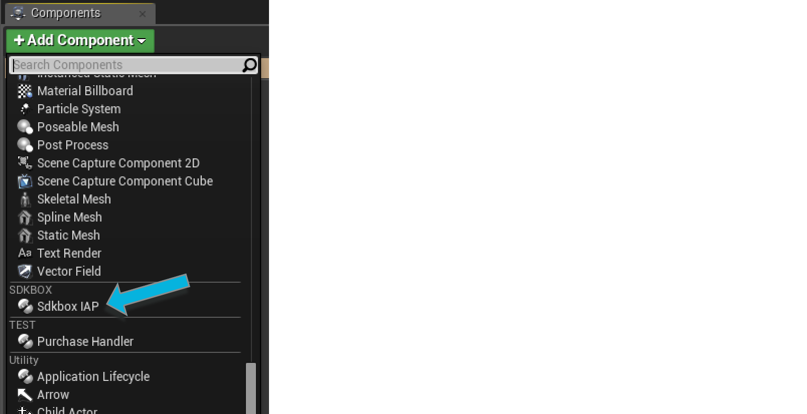
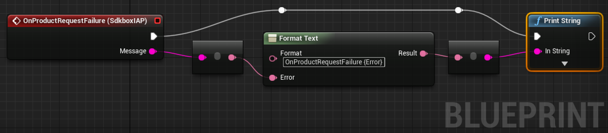
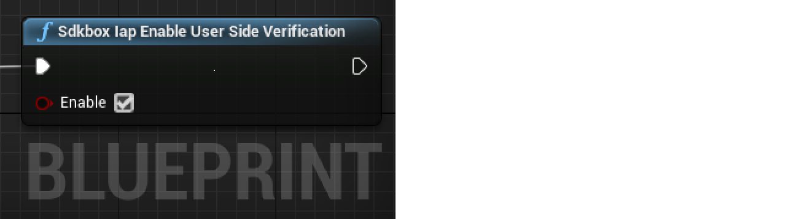

<h1>In App Purchase Documentation.</h1>

For more information, visit our website @ [www.sdkbox.com](http://cocos2d-x.org/sdkbox)

<h2>Setting up your Unreal Engine 4 project for In App Purchase</h2>

This guide does not cover creating the project itself, or creating apps in the iOS or Google app stores. For instructions on how to do that, please visit the iOS and Android documentation. 

The most important thing is setting the identifier used to identify the application in the Apple and Android store that you are going to buy from.

For Apple this is the bundle identifier, and for Android it is the android package name. This is configurable in the UE4 editor by visiting Project Settings and clicking on the iOS and Android sections and filling out those two fields with the appropriate values.

You can find more information for iOS [here](https://developer.apple.com/library/ios/documentation/LanguagesUtilities/Conceptual/iTunesConnectInAppPurchase_Guide/Chapters/Introduction.html#//apple_ref/doc/uid/TP40013727) and for Android [here](http://developer.android.com/google/play/billing/billing_overview.html)

<h2>Installing the SDKBOX IAP Plugin for UE4</h2>

Download the SDKBOX IAP Plugin from the SDKBOX UE4 website [here](http://unreal.sdkbox.com)

<h3>In Your Engine</h3>

1. Unpack the files into ```Engine/Plugins/SDKBOXIAP```
2. Run the GenerateProjectFiles script in the Engine root.
3. Open your engine project file and build the editor.

<h3>In Your Code Project</h3>

1. Unpack the files in your ```[Project Root]/Plugins``` directory.
2. Relaunch the editor. This will prompt you to build the plugin for the editor, go ahead and accept to build the plugin and continue launching the editor. 

<h2>Enable the Plugin</h2>

Goto Settings -> Plugins and scroll down to Project if you have added the plugin to your code project, otherwise it will be part of Built-In.


Make sure the the Enabled checkbox is checked. You may have to restart the editor after this step.

<h2>Initialize the Plugin</h2>

It is important to call the SDKBOX IAP initialization method early, or at least before you call any other methods. You can do this by calling it from your Game Instance Init event, or your first scene's Begin Play event.

The init method takes a JSON string as a parameter. You can pass a raw string if you would like, but you can also add the product descriptions in the Blueprint editor and build the string at runtime.


To do this, first add a variable ```Products``` of type ```SDKBox IAPProductDescription``` and make it an Array. 

Now you can add products in the editor by clicking on Products and adding items to the Default Value in the Details pane.


The Name is a string value that you will use to reference the product when purchasing.

The Id is the identifier used when creating the product in the store you are buying it from.

Consumable products can be purchased more than once, whereas Non-Consumable products can only be purchased once. This behavior is supported on all platforms.

You can have different Id's for each platform by specifying the Affinity for either iOS or Android. Specifying All will use the same details for all platforms.

You can now create a function to convert the Products variable into a JSON string that you can feed into the initialize function (pictured above).

<h2>Handling Events</h2>

You can handle events from the plugin by adding the Sdkbox IAP component to an actor in your scene.



There are 8 events that you can listen to.


You can click the ```+``` to add an event handler that you can use to implement the In App Purchase flow for your application.


You will always receive the ```OnInitialized``` event, and the ```Status``` boolean will indicate whether or not it was successful.

<h2>Receiving Products from the Store</h2>


If the initialization was successful, you will receive the ```OnProductRequestSuccess``` event and it will provide an array of products (not to be confused with product descriptions, which are similar but have limited information).

<h2>Making a Purchase</h2>


<h3>Handling Success or Failure</h3>

You can listen to the events for ```OnSuccess, OnFailure, and OnCanceled```. These events will pass you the product that is being processed.


Some events will also pass you a message that can be used for diagnostic purposes.



<h3>Restoring Products</h3>

To restore previously purchased products, simply call the restore function.


This will send you a ```OnRestored``` event for each product that has been restored, and finally it will send a ```OnRestoreComplete``` event to signal that all products have been restored. Note that it is possible to receive only the complete event in the case where you have no previously purchased products.


<h3>Verify In App Purchase Receipt</h3>

Receipt information is not sent by default, you should enable receipt verification using the following function.



And check product.receipt and product.receiptCipheredPayload for IAP receipt data in onSuccess event.

Note: only Google Play provides receipt data, iOS only provides a ciphered payload string for the user to perform IAP verification.

<h1>Code Reference</h1>

<h3>SDKBOX IAP Functions</h3>

```
UCLASS(NotBlueprintable)
class USdkboxIAPFunctions 
    : public UObject 
{
	GENERATED_BODY()
	
public:

	UFUNCTION(BlueprintCallable, meta = (Keywords = "SDKBOX iap"), Category = "SDKBOX")
	static void SdkboxIapInitialize(FString jsonstring);

    UFUNCTION(BlueprintCallable, meta = (Keywords = "SDKBOX iap"), Category = "SDKBOX")
    static void SdkboxIapShutdown();
    
	UFUNCTION(BlueprintCallable, meta = (Keywords = "SDKBOX iap"), Category = "SDKBOX")
	static void SdkboxIapPurchase(FString product);
	
	UFUNCTION(BlueprintCallable, meta = (Keywords = "SDKBOX iap"), Category = "SDKBOX")
	static void SdkboxIapRefresh();

	UFUNCTION(BlueprintCallable, meta = (Keywords = "SDKBOX iap"), Category = "SDKBOX")
	static void SdkboxIapRestore();
    
    UFUNCTION(BlueprintCallable, meta = (Keywords = "SDKBOX iap"), Category = "SDKBOX")
	static FString SdkboxIapJsonStringFromProductDescriptions(const TArray<FSdkboxIAPProductDescription>& Descriptions);
    
    UFUNCTION(BlueprintCallable, meta = (Keywords = "SDKBOX iap"), Category = "SDKBOX")
    static void SdkboxIapEnableUserSideVerification(bool enable);
};
```

<h3>SDKBOX IAP Product</h3>

```
UCLASS(ClassGroup=SDKBOX, HideCategories=(Activation, "Components|Activation", Collision), meta=(BlueprintSpawnableComponent))
class USdkboxIAPProduct
    : public UObject
{
	GENERATED_BODY()
    
public:
  
	USdkboxIAPProduct(const FObjectInitializer& ObjectInitializer);
        
    static USdkboxIAPProduct* ProductFromSdkboxProduct(const sdkbox::Product& product);
    
    // The name of the product
    UPROPERTY(BlueprintReadOnly, Category=General, meta=(DisplayName="Name"))
    FString Name;

    // The product id of an In App Purchase
    UPROPERTY(BlueprintReadOnly, Category=General, meta=(DisplayName="Id"))
    FString Id;

    // Type of iap item true if consumable
    UPROPERTY(BlueprintReadOnly, Category=General, meta=(DisplayName="Consumable"))
    bool Consumable;

    // The title of the IAP item
    UPROPERTY(BlueprintReadOnly, Category=General, meta=(DisplayName="Title"))
    FString Title;

    // The description of the IAP item
    UPROPERTY(BlueprintReadOnly, Category=General, meta=(DisplayName="Description"))
    FString Description;

    // Price value in float
    UPROPERTY(BlueprintReadOnly, Category=General, meta=(DisplayName="PriceValue"))
    float PriceValue;

    // Localized price
    UPROPERTY(BlueprintReadOnly, Category=General, meta=(DisplayName="Price"))
    FString Price;
    
    // price currency code
    UPROPERTY(BlueprintReadOnly, Category=General, meta=(DisplayName="CurrencyCode"))
    FString CurrencyCode;

    // cyphered payload
    UPROPERTY(BlueprintReadOnly, Category=General, meta=(DisplayName="ReceiptCipheredPayload"))
    FString ReceiptCipheredPayload;

    // receipt info. will be empty string for iOS
    UPROPERTY(BlueprintReadOnly, Category=General, meta=(DisplayName="Receipt"))
    FString Receipt;
};
```

<h3>SDKBOX IAP Product Description</h3>

```
UENUM(BlueprintType)
enum class EProductAffinityEnum : uint8
{
    PAE_ALL     UMETA(DisplayName="All"),
    PAE_IOS     UMETA(DisplayName="iOS"),
	PAE_ANDROID UMETA(DisplayName="Android")
};

USTRUCT(BlueprintType)
struct FSdkboxIAPProductDescription
{
    GENERATED_USTRUCT_BODY()
      
    // The name of the product
    UPROPERTY(EditAnywhere, BlueprintReadWrite, Category=General, meta=(DisplayName="Name"))
    FString Name;

    // The product id of an In App Purchase
    UPROPERTY(EditAnywhere, BlueprintReadWrite, Category=General, meta=(DisplayName="Id"))
    FString Id;

    // Type of iap item true if consumable
    UPROPERTY(EditAnywhere, BlueprintReadWrite, Category=General, meta=(DisplayName="Consumable"))
    bool Consumable;
    
    // Which platform this product description is for
    UPROPERTY(EditAnywhere, BlueprintReadWrite, Category=General, meta=(DisplayName="Affinity"))
    EProductAffinityEnum Affinity;
};
```


