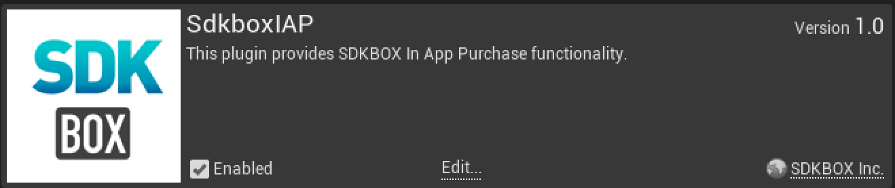
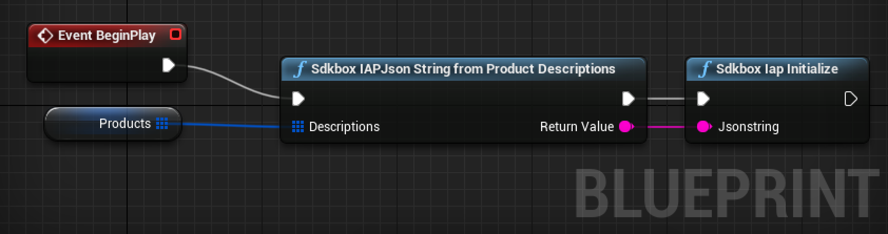
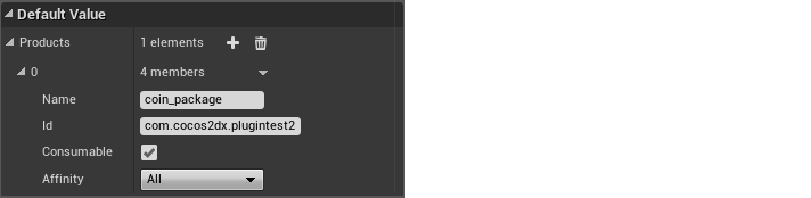
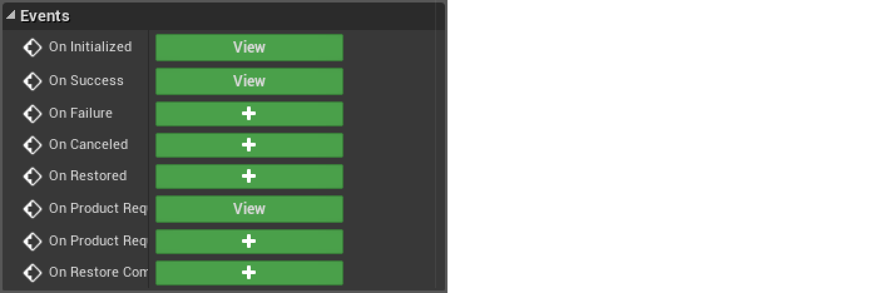
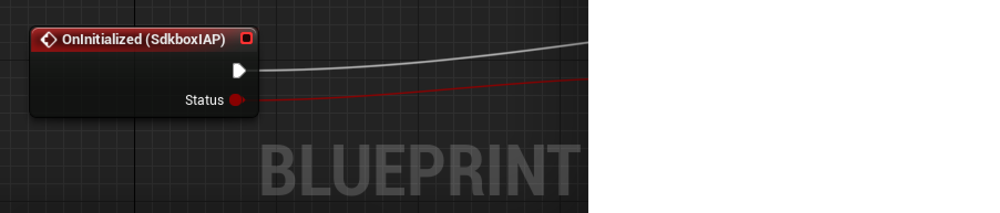
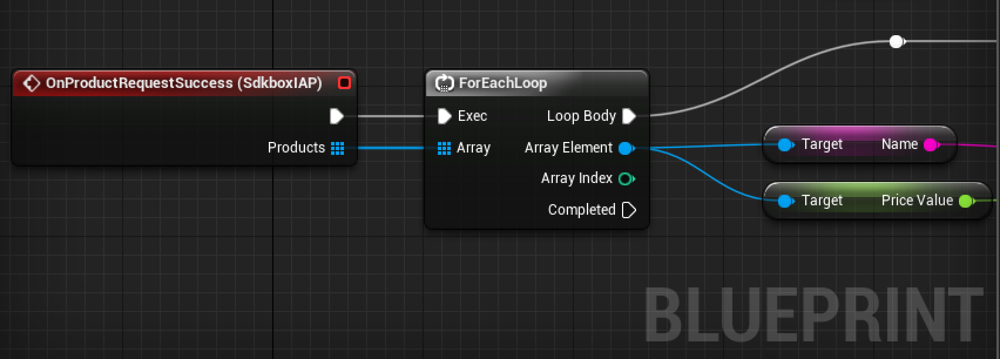

**In App Purchase Documentation.**

For more information, visit our website @ [www.sdkbox.com](http://cocos2d-x.org/sdkbox)

**Setting up your Unreal Engine 4 project for In App Purchase**

This guide does not cover creating the project itself, or creating apps in the iOS or Google app stores. For instructions on how to do that, please visit the iOS and Android documentation. 

The most important thing is setting the identifier used to identify the application in the Apple and Android store that you are going to buy from.

For Apple this is the bundle identifier, and for Android it is the android package name. This is configurable in the UE4 editor by visiting Project Settings and clicking on the iOS and Android sections and filling out those two fields with the appropriate values.

You can find more information for iOS [here](https://developer.apple.com/library/ios/documentation/LanguagesUtilities/Conceptual/iTunesConnectInAppPurchase_Guide/Chapters/Introduction.html#//apple_ref/doc/uid/TP40013727) and for Android [here](http://developer.android.com/google/play/billing/billing_overview.html)

**Installing the SDKBOX IAP Plugin for UE4**

Download the SDKBOX IAP Plugin from the SDKBOX UE4 website [here](http://unreal.sdkbox.com)

**In Your Engine**

1. Unpack the files into ```Engine/Plugins/SDKBOXIAP```
2. Run the GenerateProjectFiles script in the Engine root.
3. Open your engine project file and build the editor.

**In Your Code Project**

1. Unpack the files in your ```[Project Root]/Plugins``` directory.
2. Relaunch the editor. This will prompt you to build the plugin for the editor, go ahead and accept to build the plugin and continue launching the editor. 

**Enable the Plugin**

Goto Settings -> Plugins and scroll down to Project if you have added the plugin to your code project, otherwise it will be part of Built-In.



Make sure the the Enabled checkbox is checked. You may have to restart the editor after this step.

**Initialize the Plugin**

It is important to call the SDKBOX IAP initialization method early, or at least before you call any other methods. You can do this by calling it from your Game Instance Init event, or your first scene's Begin Play event.

The init method takes a JSON string as a parameter. You can pass a raw string if you would like, but you can also add the product descriptions in the Blueprint editor and build the string at runtime.



To do this, first add a variable ```Products``` of type ```SDKBox IAPProductDescription``` and make it an Array. 

Now you can add products in the editor by clicking on Products and adding items to the Default Value in the Details pane.



The Name is a string value that you will use to reference the product when purchasing.

The Id is the identifier used when creating the product in the store you are buying it from.

Consumable products can be purchased more than once, whereas Non-Consumable products can only be purchased once. This behavior is supported on all platforms.

You can have different Id's for each platform by specifying the Affinity for either iOS or Android. Specifying All will use the same details for all platforms.

You can now create a function to convert the Products variable into a JSON string that you can feed into the initialize function (pictured above).

**Handling Events**

There are 8 events that you can listen to.



You can click the ```+``` to add an event handler that you can use to implement the In App Purchase flow for your application.



You will always receive the ```OnInitialized``` event, and the ```Status``` boolean will indicate whether or not it was successful.

**Receiving Products from the Store**



If the initialization was successful, you will receive the ```OnProductRequestSuccess``` event and it will provide an array of products (not to be confused with product descriptions, which are similar but have limited information).

**Making a Purchase**


